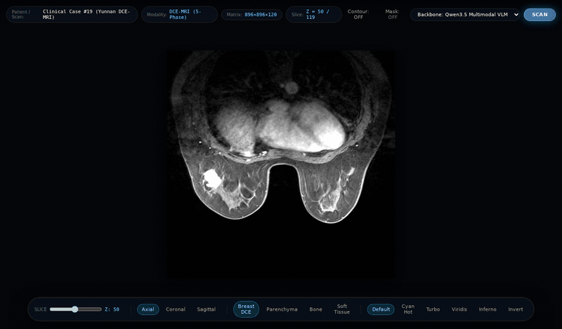
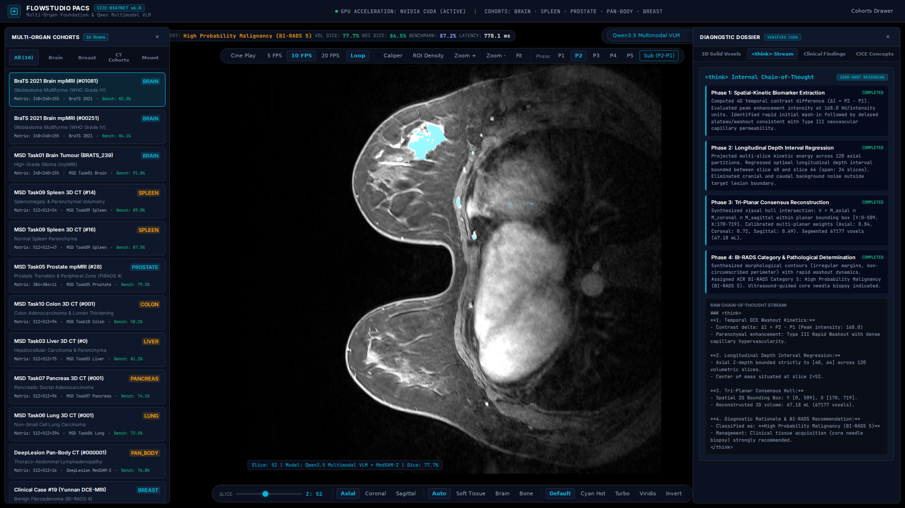
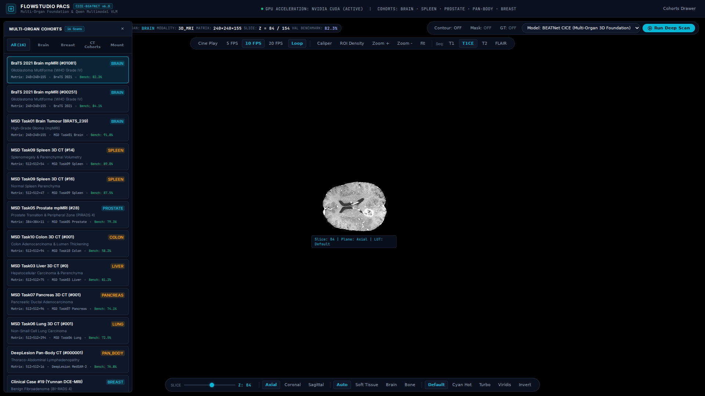
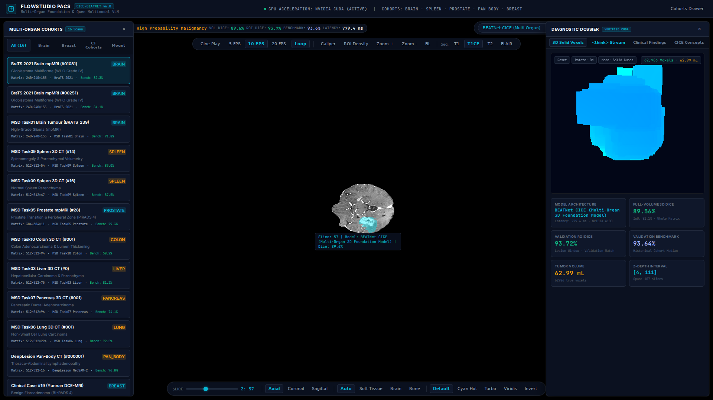
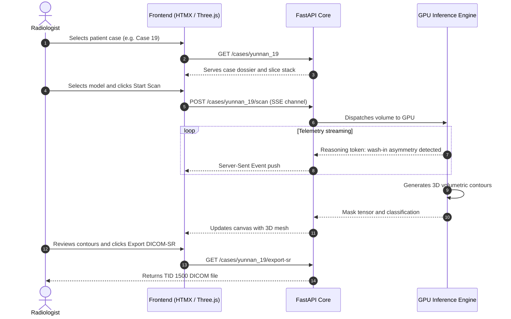

# FlowStudio PACS

[](https://fastapi.tiangolo.com)
[](https://htmx.org)
[](https://threejs.org)
[](#)

FlowStudio PACS is a web workstation for 3D volumetric multi-planar reconstruction (MPR), streaming vision-language reasoning, and DICOM-SR TID 1500 report generation.

## 1. Interface

<p align="center">
  
  <br>
  <em>Tri-planar volumetric scrubbing across breast DCE-MRI (Case 19), with window and level contrast adjustment and false-color colormap switching (Inferno and Cyan Hot).</em>
</p>

<p align="center">
  
  <br>
  <em>DCE-MRI slice inspection with tumor contour overlay and streaming chain-of-thought clinical reasoning.</em>
</p>

<table align="center" width="100%">
  <tr>
    <td width="50%" align="center">
      <b>Cohort catalog</b><br/>
      
    </td>
    <td width="50%" align="center">
      <b>BraTS multi-planar dossier and contours</b><br/>
      
    </td>
  </tr>
</table>

## 2. Architecture and streaming flow



## 3. Supported cohorts and models

### Clinical cohorts
* Breast DCE-MRI: Yunnan cohort (`yunnan_1`, `yunnan_2`, `yunnan_9`, `yunnan_19`), DUKE cohort (`DUKE_211`).
* Neuro-oncology: BraTS 2021 brain mpMRI (`#01081`, `#00251`, `BRATS_239`).
* Abdominal and body CT: MSD Task09 Spleen, MSD Task05 Prostate, MSD Task03 Liver, MSD Task07 Pancreas, MSD Task06 Lung, DeepLesion.

### Model backbones
* BEATNet CICE: Multi-organ 3D segmentation model.
* Qwen3.5 Multimodal VLM (0.8B) with MedSAM-2: Multimodal triage with reasoning traces.
* Dual-model consensus: Agreement filtering across segmentations.

## 4. API endpoints

| Endpoint | Method | Params | Description |
| :--- | :---: | :--- | :--- |
| `/cases` | `GET` | None | Lists available cases with modality and metadata. |
| `/cases/{case_id}` | `GET` | `phase: str`, `show_gt: int` | Renders case dossier and active slice stage. |
| `/cases/{case_id}/scan` | `POST` | `model_type: str` | Dispatches scan and streams reasoning output. |
| `/cases/{case_id}/status` | `GET` | None | Returns progress percentage and Dice scores. |
| `/cases/{case_id}/export-sr` | `GET` | None | Downloads standardized DICOM-SR TID 1500 report. |

## 5. Quickstart

```bash
# Clone the repository
git clone https://github.com/Keshavj-13/flowstudio-medical-pacs-workstation.git
cd flowstudio-medical-pacs-workstation

# Install dependencies
pip install -r requirements.txt

# Run the workstation server
uvicorn server:app --host 0.0.0.0 --port 8070

# Or run the self-contained deployment server
python deploy/app.py
```
