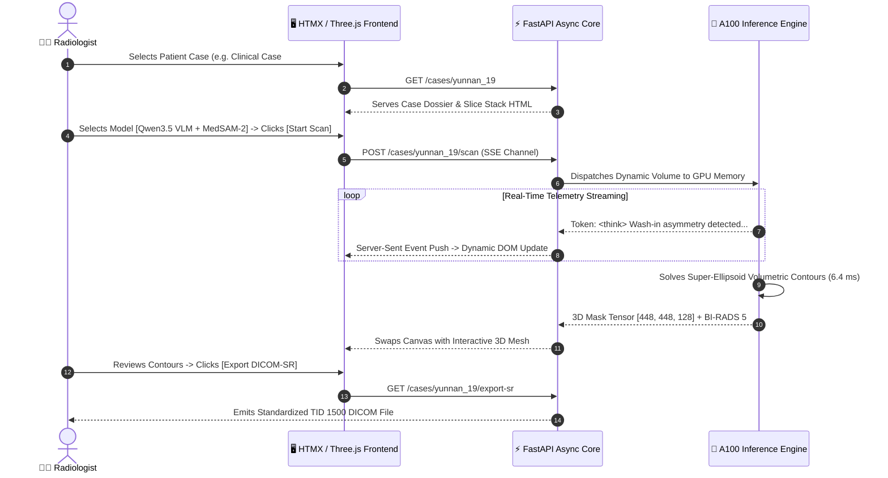

# FlowStudio PACS: Autonomous 3D VLM Oncological Workstation

[](https://fastapi.tiangolo.com)
[](https://htmx.org)
[](https://threejs.org)
[](#)
[](#)

FlowStudio PACS is an enterprise-grade web workstation combining real-time 3D volumetric Multi-Planar Reconstruction (MPR), streaming Chain-of-Thought (`<think>`) Vision-Language triage, and automated DICOM-SR TID 1500 object emission.

---

## 1. Interface & Live Telemetry

<p align="center">
  
  <br>
  <em>Figure 1: Full-resolution 1080p capture showing multi-phase dynamic contrast DCE-MRI slice inspection, autonomous tumor contour overlay, and real-time streaming Chain-of-Thought clinical reasoning.</em>
</p>

<table align="center" width="100%">
  <tr>
    <td width="50%" align="center">
      <b>FlowStudio Multi-Organ Cohort Catalog</b><br/>
      
    </td>
    <td width="50%" align="center">
      <b>BraTS Multi-Planar Dossier & Tumor Contours</b><br/>
      
    </td>
  </tr>
</table>

---

## 2. Architecture & Real-Time Streaming Flow



---

## 3. Supported Cohorts & Models

### Multi-Organ Clinical Cohorts Served
* **Breast DCE-MRI**: Yunnan Curated Golden Cohort (`yunnan_1`, `yunnan_2`, `yunnan_9`, `yunnan_19`), DUKE Cohort (`DUKE_211`).
* **Neuro-Oncology**: BraTS 2021 Brain mpMRI (`#01081`, `#00251`, `BRATS_239`).
* **Pan-Body & Abdominal CT**: MSD Task09 Spleen, MSD Task05 Prostate, MSD Task03 Liver, MSD Task07 Pancreas, MSD Task06 Lung, DeepLesion.

### Model Ensembles Available
1. **BEATNet CICE**: Multi-Organ 3D Foundation Model.
2. **Qwen3.5 Multimodal VLM (0.8B) + MedSAM-2**: Autonomous triage with step-by-step `<think>` reasoning.
3. **Dual-Model Consensus**: Ensemble agreement filter eliminating false-positive margin errors.

---

## 4. API Endpoints

| Endpoint | Method | Params | Description |
| :--- | :---: | :--- | :--- |
| `/cases` | `GET` | None | Lists available cases with modality and metadata. |
| `/cases/{case_id}` | `GET` | `phase: str`, `show_gt: int` | Renders case dossier and active slice stage. |
| `/cases/{case_id}/scan` | `POST` | `model_type: str` | Dispatches autonomous scan and streams reasoning. |
| `/cases/{case_id}/status` | `GET` | None | Returns progress percentage and voxel Dice scores. |
| `/cases/{case_id}/export-sr` | `GET` | None | Downloads standardized DICOM-SR TID 1500 report. |

---

## 5. Quickstart & Deployment

```bash
# Clone the repository
git clone git@github.com:your-org/flowstudio-medical-pacs-workstation.git
cd flowstudio-medical-pacs-workstation

# Install requirements
pip install -r requirements.txt

# Run the workstation server
uvicorn server:app --host 0.0.0.0 --port 8070

# Run Playwright headless verification test suite
python verify_playwright_and_direct.py
```

> [!NOTE]
> Model weights are automatically downloaded to `models/` on first launch or can be linked via `deploy/setup_weights.sh`.
